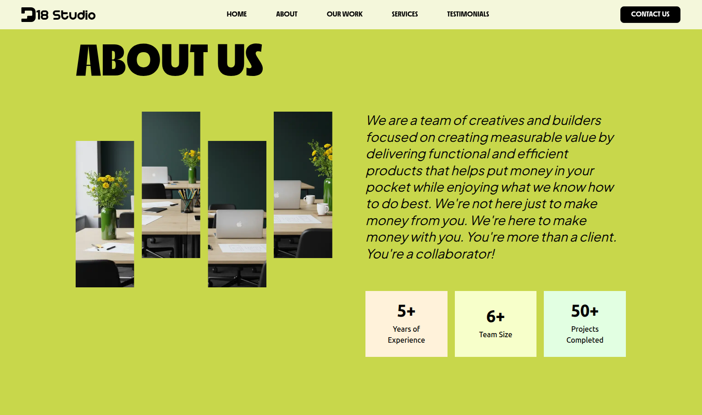

# DB Studio Website

A modern, responsive website for **DB Studio** – a creative agency focused on delivering functional and efficient products.
Built with **Next.js**, **TypeScript**, and **Tailwind CSS**.

🚀 [**Live Demo**](https://d18-studio-eight.vercel.app/)

---

## ✨ Features

- **Modern Design**: Clean, professional layout with a distinctive green color scheme
- **Responsive**: Fully responsive design that works on all devices
- **Performance Optimized**: Built with Next.js for optimal loading speeds
- **Type Safe**: Written in TypeScript for better code quality
- **Styled with Tailwind**: Utility-first CSS framework for rapid development

---

## 🛠️ Tech Stack

| Category   | Tech            |
|------------|-----------------|
| Framework  | Next.js         |
| Language   | TypeScript      |
| Styling    | Tailwind CSS    |
| Deployment | Vercel (or any) |

---
